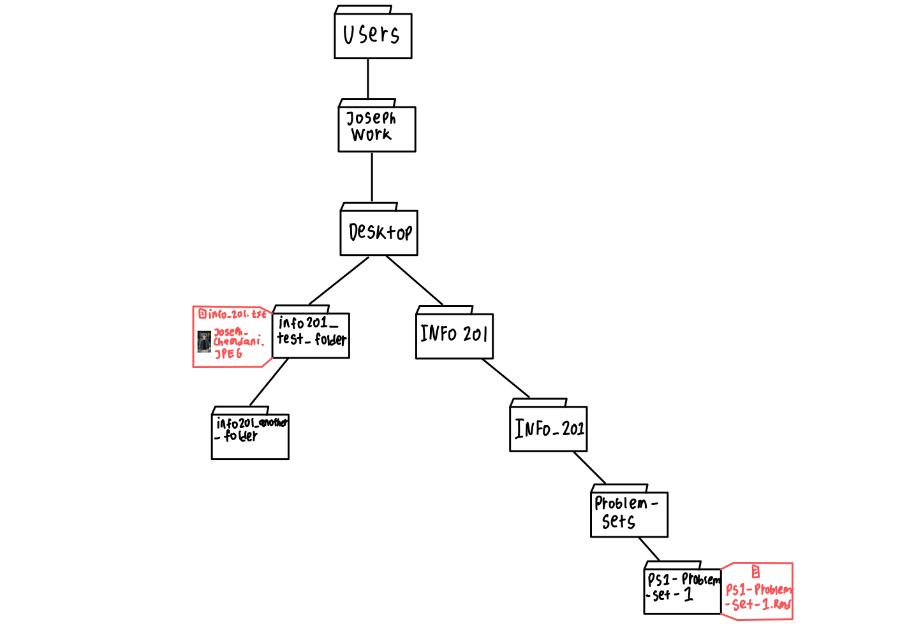
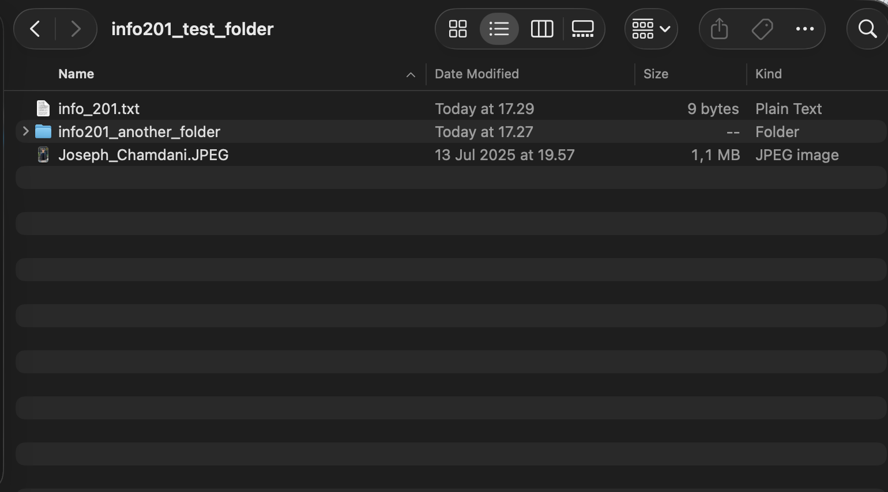

## **1 Markdown**

### **1.1**

#### **1.1.1  Create a bullet list of (at least 3) colors**
* Red 🔴
* Green 🟢
* Blue 🔵

---

#### **1.1.2  Create a numbered list of (at least 3) cities**
1. Seattle 🇺🇸
2. Jakarta 🇮🇩
3. Malang 🇮🇩

---

#### **1.1.3  Create a pre-formatted text (at least 3 lines)**
```
This is line 1
This is line 2
And here’s line 3
```

---

#### **1.1.4  Sentence with bold and italic**
This is a sentence with **bold** and also *italic* text mixed in.

---

#### **1.1.5  Table with prices**
| Item         |   QFC | Safeway |
|:-------------|-----:|-------:|
| Green onion  |  1.39 |   0.99 |
| Chicken      |  4.32 |   4.69 |
| Whole milk   |  3.49 |   3.19 |

---

#### **1.1.6  Code block with ASCII art**
```
  |\_/| 
 ( o.o )  meow
  > ^ <
```

---

#### **1.1.7  A line with inline code**
Inline code looks like this:`print("hello meow")`.

---

## **2 File system**

### **2.1**
#### **2.1.1  Homework folder**
My homework `.Rmd` file is saved in the folder: `PS1-problem-set-1`.  
Its parent folder is `Problem-Sets`.

---

### **2.2**
#### **2.2.1  Folder on Desktop**
I made a folder on my Desktop called `info201_test_folder`. Inside, I dropped in:  

* an image file (`Joseph_Chamdani.JPEG`)  
* a non-image file (`info_201.txt`)  
* another folder (`info201_another_folder`)  

---

### **2.3**
#### **2.3.1  File system sketch**
Here’s my sketch showing how the folders connect.  





---

### **2.4**
#### **2.4.1  Relative path of new folder**
From my `.Rmd` file, the relative path to the Desktop folder is:  
`../../../../info201_test_folder`

---

### **2.5**
#### **2.5.1  Screenshot of the new folder**
I took a screenshot of the folder and saved it as `screenshot.png` in the same place as my `.Rmd`.  
Relative path: `screenshot.png`

---

### **2.6**
#### **2.6.1  Screenshot in RMarkdown**



---

### **2.7**
#### **2.7.1  Image in new folder (using relative path)**
And here’s me including the image directly from the Desktop folder:  


*(Note: This uses a **relative path** that points outside my homework folder:  
`../../../../info201_test_folder/Joseph_Chamdani.JPEG`.  
It works on my computer, but may not display on another machine since they don’t have this Desktop folder.


---

## **3 Absolute path**

### **3.1**
#### **3.1.1  Homework folder absolute path**

The absolute path to my homework folder is:  
`/Users/JosephWork/Desktop/INFO 201/INFO_201/Problem-Sets/PS1-problem-set-1`

---

### **3.2**
#### **3.2.1  Absolute path of the image in test folder**

The absolute path of the image I put in the test folder on my Desktop is:  
`/Users/JosephWork/Desktop/info201_test_folder/Joseph_Chamdani.JPEG`

---

### **3.3**
#### **3.3.1  Include the image with absolute path**
Here’s how it looks when included using the absolute path:  


*(Note: This is the **absolute path** on my machine:  
`/Users/JosephWork/Desktop/info201_test_folder/Joseph_Chamdani.JPEG`.  
Absolute paths are machine-specific, so this will not show up on another computer.)*


---

### **3.4**
#### **3.4.1  Which path is better?**
I’d say relative paths are better for homework. That way if I move or share my project folder, the images will still load. Absolute paths only work on my own computer.

---

### **3.5**
#### **3.5.1  RStudio filename completion**
In RStudio, you can start typing a filename inside quotes and hit Tab. It’ll autocomplete with the files in your working directory and it's helpful so you don’t mistype long file names.

---


## **4 Variables**

### **4.1**
#### **4.1.1  My age**
```{r}
my_age <- 18
print(paste("My age now is", my_age, "years old"))
```

---

### **4.2**
#### **4.2.1  Seconds in a year**
```{r}
seconds_in_year <- 60 * 60 * 24 * 365
print(paste("There are", seconds_in_year, "seconds in a year"))
```

---

### **4.3**
#### **4.3.1  My age in seconds**
```{r}
age_in_seconds <- my_age * seconds_in_year
print(paste("My age in seconds is", age_in_seconds, "seconds"))
```

---

### **4.4**
#### **4.4.1  Typical human lifetime in seconds**
So I'll assume that a “typical” lifetime of about 78 years.  

```{r}
lifetime_years <- 78
lifetime_seconds <- lifetime_years * seconds_in_year
print(paste("So a typical human lifetime is", lifetime_seconds, "seconds"))
```

---

## **5 Syllabus**

### **5.1**
#### **5.1.1  Total points from all problem sets (including PS0)**
There are 7 assignments (problem sets) worth 49% of the grade, so if I did them all perfectly, that’s **49 points total**.

---

### **5.2**
#### **5.2.1  Points from all labs combined**
There are 7 labs, each worth 1 point → **7 points total**.

---

### **5.3**
#### **5.3.1  Deadline for Final Project Proposal**
The Final Project Proposal due date is on **November 5 at 11:59 pm** from what
I saw on the lab due date.

---

### **5.4**
#### **5.4.1  Quizzes true/false**
Yep True,
The course has 2 quizzes, together worth 20% of the final grade.

---

### **5.5**
#### **5.5.1  Late days for Problem Sets**
Each student has **3 late days** for problem sets. After that, late submissions lose 0.5% per hour.

---

### **5.6**
#### **5.6.1  Late days for labs**
Labs have **no late days** you either do them on time or lose the point.

---

### **5.7**
#### **5.7.1  Deadline for regrade requests**
Regrade requests must be made **within one week after grades are released**, but no later than **Dec 9th**.

---

### **5.8**
#### **5.8.1  Caption of the first figure in Section “6.3.1 Vectorized Operators”**
The first figure’s caption is: **“Adding two vectors, element-wise.”**

---

### **5.9**
#### **5.9.1  AI usage true/false**
Yep True 
I need to always cite AI usage, and I can’t just copy-paste AI solutions.

---

### **5.10**
#### **5.10.1  Discord**
Not required, but yep, I already joined the INFO 201 Discord: [https://discord.gg/KxGT2nXT9J](https://discord.gg/KxGT2nXT9J)

---
